# autoDragonsweeper

**All credit for the original game Dragonsweeper goes to Daniel Benmergui.**

Please visit <a href="https://danielben.itch.io/dragonsweeper">https://danielben.itch.io/dragonsweeper</a> for its official release.


<table width="100%">
  <tr>
    <td width="50%"> <a href="game.html">  </a> </td>
    <td width="50%"> <a href="game.html">  </a> </td>
  </tr>
</table>

<h1><a href = "game.html"> Click here to play!</a> </h1>

After enjoying Dragonsweeper a lot, I decided to try and have a crack at solving it programmatically.

The main additions compared to the original game (v1.1.18):
- Tile monster hints (can turn off in settings)
    - Blue for known power
    - Red for upper limit on power (or optionally, a range between low:high)
- Clicking on the board performs 'free' actions when available (can turn off in settings)
    - Reveal tiles with 0 power
    - Taking xp
    - Level up when at 0 hp
    - Casting spells
    - Opening chests (when known not to be a mimic)
- Clicking on XP bar performs an action picked by an automated solver
- Dragon lair is now generated with some integer seed
    - See what your seed is, share it, and others can play the same dungeon!
    - You can find it in the monsternomicon

Looking for a challenge? Take a crack at some seed my solver doesn't solve:

v17:
`982076172, 103855545, 2600539032, 1236143507, 2117130815, 3968560058, 2730886631, 1663344264, 600097793, 1096928327, 198228856, 1865341857, 861855837, 450948120, 2118337003, 2747216787, 3474109513, 3675091304, 2403529648, 2795602454, 50962058, 181675942, 4106662133, 2267233549, 38037183, 3495307853, 3553396303`

v18:
`2053242367, 1942864448, 737164330, 2263168761, 1350173042, 3736902895, 693304165, 848014395, 2226969393, 452132014, 2662640291, 626331229, 2926256338, 3623990632, 1849632308, 4199661045, 3069707154`

v21:
`3176113192, 3925959345, 2488958036, 1564206090, 1557196361, 139739039, 2309594079, 1943299590, 3243012160, 1304931236, 1239211766, 926292535, 3359350696, 2501565802, 1308133567, 236855426`

v22:
`2013347088, 2192313174, 1639253265, 1815710409, 2122597714, 3717114829, 2672500049, 712673713, 3865424773, 683940674, 3330252169, 2885331457, 3530625750, 2450094780, 297012768, 2096272193, 4102034837, 2996040991`

Good luck!

Some quick statistics about the latest iteration of the solver (v22):

```none
2000 games: 1982 won, 1863 cleared (119 won but failed to clear)
Had to risk it in 0.6% of won games; 1.7% when no clear, 0.5% when clear
Average early wall hits: 0.31 when cleared, 1.33 when won without clear, 1.39 when lost
Average mine king delay: 0.17 when cleared, 0.63 when won without clear
When lost, on average had 44.39 score
When won without clear, on average had 362.53 score
When won without clear, on average had 4.24 damage to go
When cleared, on average had 6.04 hp left over
Most hp left when cleared: 13 (happened 18 times)
Lost without risk: 1
```

You can find all the code in my [github repository](https://github.com/Hodobox/autodragonsweeper).

<h2> Figuring out the lair </h2>

So before I can try to come up with a strategy on what action to take, my solver will need some information first.
As much of it as possible. I will call the sum of everything the solver knows about the lair the *known game state*.
Yes, it's a singleton.

I would categorize the types of things we can know about the lair into four categories:

1. If a tile is unrevealed (or looks like a chest), what could be on this tile
2. What a set of tiles must contain (e.g. 4 corner tiles = one of them must be the Mine King)
3. If a tile is revealed, what *used* to be on this tile (e.g. it's empty, but it was a Big Slime, or a chest, ...)
4. What game-changing actions we have performed (e.g. found the Dragon Egg, killed the Wizard, killed the Rat King, ...)

Knowledge of types 3 and 4 is relatively straightforward to obtain and store.
For type 3, for each tile I just record what the entity is the first time it's figured out.
For type 4, just detect when a game-changing action is being performed (clicking a spell, ...) and individually note it down in the known game state.

Knowledge of type 1 and 2 is the real problem, and we must utilize monster patterns and relationships between the knowledge we already have to deduce more of it.
Type 1 knowledge boils down to keeping track, for each tile, what set of objects could be there. Knowledge of type 2 is more complex, because it involves
relationships between sets of tiles. In my implementation, this knowledge is not persisted; at several points it is computed,
used either to deduce knowledge of type 1 or to make a decision in the solver, and then it is discarded.

So 90% of all the information gathering are deduction rules, using the available knowledge of all types to obtain more knowledge of type 1. In particular, since
the set of possible objects for a given tile can never grow when we obtain more information about it, it essentially boils down to ruling out the possibilities
for each tile and removing that object from its set.

Oh, and at the beginning, we of course must know what possible objects could be on each tiles.

<details markdown=1>
<summary> Click here if you want the list </summary>

- Empty, Wall, Gnome, Medikit, Chest, Rat, Bat, Skeleton, Gargoyle, Slime, Rat King, Gazer, Minotaur, Mimic in every tile
- Romeo & Juliet on any tile not in the middle column
- Guard on any tile not in the middle column or Dragon's row
- Mine King in the corners
- Wizard on the edge but not in the corner
- Big Slime on the edge or near the edge
- Dragon Egg neighboring the Dragon
- Dragon in the middle. *Well*... Did you notice there are more rows below him than above him? So not quite.

</details>

<br>
We'll get down to all the rules in a jiffy, but in case you stumble on some term I'm using, here's your

<details markdown=1>
<summary> <b>Glossary</b> </summary>

- the number displayed on a revealed empty tile is its *attack number*
- the set of possible objects in a tile are its *possible actors*
- if we know the power of a tile, that's its *known power*
- if we additionally know exactly what is on the tile, that's its *known actor*
- a tile for which we don't know its power is an *unknown* tile
- the tiles directly next to a tile in the 4 basic directions are its *cross neighbors*
- the (up to) 8 tiles surrounding a tile are its *neighbors*

</details>

<h3> The very basics </h3>

- If we have a tile with an attack number, and the known powers of its neighbors sum up to this number, then all the unknown neighbors are 0s

And so we will rule out all monsters from these unknown neighbors.

<table width="100%">
  <tr>
    <td width="50%">   </td>
    <td width="50%"> 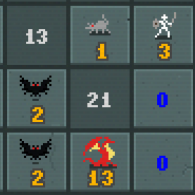 </td>
  </tr>
  <tr>
    <td colspan="2" width="100%" style="text-align:center"> 1+3+3+2+13 = 21 </td>
  </tr>
</table>


- If we have a tile with an attack number, and we known the power of every neighbor except of one, we can work out this unknown tile's power

And so we will rule out all monsters from this tile which don't have exactly this power.

<table width="100%">
  <tr>
    <td width="50%">   </td>
    <td width="50%"> 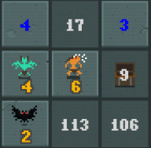 </td>
  </tr>
  <tr>
    <td colspan="2" width="100%" style="text-align:center"> 17-3-4-6 = 4 </td>
  </tr>
</table>

- If we have a tile with an attack number A, and the sum of the known powers of its neighbors is K, then its unknown neighbors must have power at most A-K

(this is technically a generalized version of the first rule, but I added this one later)

<table width="100%">
  <tr>
    <td width="50%">   </td>
    <td width="50%"> 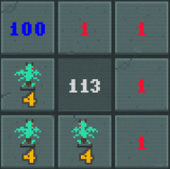 </td>
  </tr>
  <tr>
    <td colspan="2" width="100%" style="text-align:center"> 113-(100+4+4+4) = 1 </td>
  </tr>
</table>

<h3> Too big and too small </h3>

- If we have a tile with attack number A, and the sum of the lowest possible powers of all neighbors except one is L, then the unaccounted-for 
neighbor's power is at most A-L

<table width="100%">
  <tr>
    <td width="50%">   </td>
    <td width="50%"> 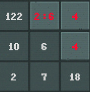 </td>
  </tr>
  <tr>
    <td colspan="2" width="100%" style="text-align:center"> For the unknown 5 and 6, 6-(2+0s) = 4; so they must be <= 4 </td>
  </tr>
</table>

- Analogously we can do the same thing from below: if a tile has attack number A, and the
sum of the maximum possible powers of all neighbors except one is M, then the last unaccounted-for neighbor's power is at least A-M

<table width="100%">
  <tr>
    <td width="50%">   </td>
    <td width="50%"> 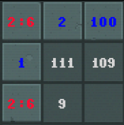 </td>
  </tr>
  <tr>
    <td colspan="2" width="100%" style="text-align:center"> 111-(100+2+1+6+0s) = 2, so top-left tile is at least 2 </td>
  </tr>
</table>

We do this separately for mines and creatures (even if a tile shows 105, and its neighbor could be a mine with power 100, in terms of creatures
it could be at most a 5, so this puts limits on the creatures that can be in the other neighbors). So in the example above, we are really doing
11 - (... + strongest creature which could be on the mine's tile).

<h3> Utilizing type 4 knowledge </h3>

Knowledge gained from game-changing actions is pretty straightforward

- If we disarmed the mines, no tile can contain a mine, and those which we knew were mines becomes treasures instead (...kind of. Works well enough
for our purposes)

<table width="100%">
  <tr>
    <td width="50%">   </td>
    <td width="50%"> 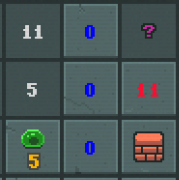 </td>
  </tr>
  <tr>
    <td colspan="2" width="100%" style="text-align:center"> We would've known 100->0 even if other rules couldn't deduce it </td>
  </tr>
</table>

- If we revealed slimes, every tile that isn't a revealed slime cannot contain a slime

This helps us because if we find a 5 after revealing slimes (and we know it's not a gazer because of the lack of ?), we know it's the Rat King himself!

- If we revealed rats, every tile that isn't a revealed rat cannot contain a rat

This helps because if we know a tile isn't power 0, it must be at least a 2. Boosts the power of the rules described in the previous section!

<h3> Simple category 2 rules </h3>

Some enemies in the game exist only once. Once you've found them, they can't be anywhere else:

- Mimic
- Rat King
- Wizard
- Mine King
- Dragon Egg

So once we spot them, we rule them out from all other tiles.

Additionally, we know that exactly one corner tile contains the Mine King. So, if we know he isn't in three of the corners, we can
tell he's in the fourth.

<table width="100%">
  <tr>
    <td width="50%">   </td>
    <td width="50%"> 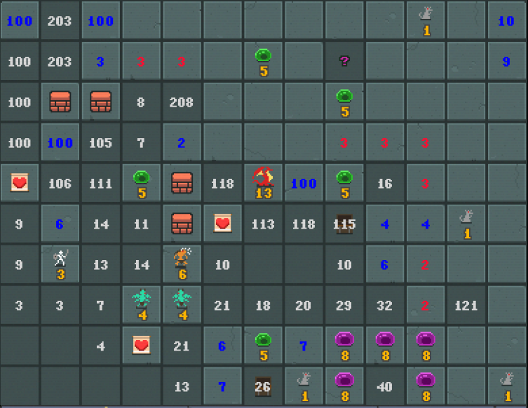 </td>
  </tr>
  <tr>
    <td colspan="2" width="100%" style="text-align:center"> No other place for the Mine King other than top-right </td>
  </tr>
</table>

- If there is a tile with X mines not found around it, and there are X tiles among its neighbors that could be mines, well, they have to be there

<table width="100%">
  <tr>
    <td width="50%">   </td>
    <td width="50%"> 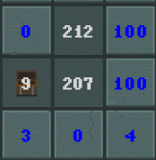 </td>
  </tr>
  <tr>
    <td colspan="2" width="100%" style="text-align:center"> Boom and Boom </td>
  </tr>
</table>


<h3> Fancy type 2 rules </h3>

You're about to learn some Dragonsweeper.

- Romeo & Juliet (a.k.a. the lovers (but technically `ActorId.Giant`)) 
    - ...are in the same row, looking at one another, at equal distance from the center.

So, if you find one, the other one's in the same row and with the opposite column index.

<table width="50%">
  <tr>
    <td width="100%">   </td>
  </tr>
  <tr>
    <td width="100%" style="text-align:center"> She's all the way over there! </td>
  </tr>
</table>

The inverse is also true - if a tile
cannot contain a lover, its column-mirrored tile also does not.

<table width="50%">
  <tr>
    <td width="100%">   </td>
  </tr>
  <tr>
    <td width="100%" style="text-align:center"> No lover right to the left of the 26? No lover to right to the right of the 26, either! </td>
  </tr>
</table>

And also, once we found them, we know they don't appear anywhere else.

- Walls
    - ...come in pairs!

A wall is always a cross neighbor of another wall. So, if you found a wall, and there's no wall in 3 directions... it's in the fourth one!

<table width="100%">
  <tr>
    <td width="50%">   </td>
    <td width="50%"> 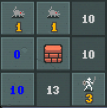 </td>
  </tr>
  <tr>
    <td colspan="2" width="100%" style="text-align:center"> No other place to build the wall. Oh, hi Mine King! </td>
  </tr>
</table>

- Gargoyles
    - Gargoyle**s**, plural. They come in pairs, same as walls! So the same argument works as before for walls. 
    
Even better, if you reveal one, it is looking straight at the other one!

<table width="100%">
  <tr>
    <td width="50%">   </td>
    <td width="50%"> 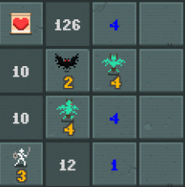 </td>
  </tr>
  <tr>
    <td colspan="2" width="100%" style="text-align:center"> The top gargoyle is looking straight at its twin <br> The bottom gargoyle, even if it was unrevealed, only has 1 space for its twin </td>
  </tr>
</table>

- Minotaurs
    - Yell at you when you open their chest for a reason. It's *their chest*. 5 chests and 5 minotaurs. Coincidence? I think not!

If you find a minotaur, and you didn't find a chest near him, and there is only 1 possible space left for it to be... there it is!

If you find a chest, and you didn't find a minotaur near it, and there is only 1 possible space left for him to be... there he is!

<table width="100%">
  <tr>
    <td width="50%">   </td>
    <td width="50%"> 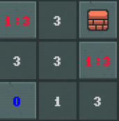 </td>
  </tr>
  <tr>
    <td colspan="2" width="100%" style="text-align:center"> The 3 in the middle used to be a minotaur <br> Only neighbor that could be a chest is bottom left </td>
  </tr>
</table>

~~This basically never happens. In the couple thousand games I've tested, this rule was not triggered even once.
I can force it if I purposefuly try to set it up though!~~ It actually works. I was just incrementing the variable
incorrectly (specifically, instead incrementing one that doesn't exist), and of course javascript was like okie dokie. I fixed it now,
it does indeed happen. Woo!


What (...also) does happen is a fun corollary - a chest without any minotaur around it is definitely a mimic.

<table width="100%">
  <tr>
    <td width="50%">   </td>
    <td width="50%"> 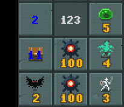 </td>
  </tr>
  <tr>
    <td colspan="2" width="100%" style="text-align:center"> The 123 used to be a bat. No minotaur next to that chest? Exposed! </td>
  </tr>
</table>

- Guards
    - ...practice social distancing. Have you noticed each guard has a red pixel on his shield, in one of its quarters? 
    That's because the guard is in that quarter of the lair! And he guards it alone.

If you spot a guard, he's the only one in that quadrant (isolated by the central column and Dragon's row).

<table width="100%">
  <tr>
    <td width="50%">   </td>
    <td width="50%"> 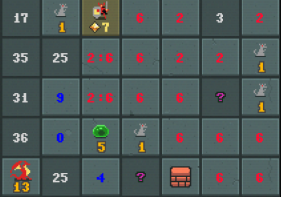 </td>
  </tr>
  <tr>
    <td colspan="2" width="100%" style="text-align:center"> Top-right guard with top-right pixel <br> Note how at-most-7s became 6s </td>
  </tr>
</table>


<h3> Hunt for the Wizard </h3>

The Wizard and his Big Slimes are a unique configuration. We need to be able to spot him through the Big Slimes, because punching
through them takes loads of hp.

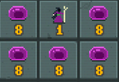

Once we spot the Wizard, we can also tell that all unrevealed tiles surrounding him are Big Slimes.

So firstly, because Big Slimes are always together, after we spot one, we can rule them out from any tile that is far away from it.
The most distant pair of Big Slimes is separated by a distance of sqrt(5). So, rule out Big Slimes from tiles further than that from the one
we found.

Secondly, a Big Slime always cross-neighbors another Big Slime. Slightly more strongly, a Big Slime not on the edge must have 2 Big Slime neighbors,
a Big Slime in the corner must have 1 on the edge, and other Big Slimes on the edge must have 1 that is not on the edge.
So, if we have a tile where we think a Big Slime could be, and there aren't enough tiles around it
where Big Slimes could be to satisfy this requirement, we can rule it out from there.

<table width="100%">
  <tr>
    <td width="50%">   </td>
    <td width="50%"> 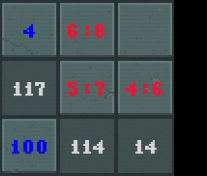 </td>
  </tr>
  <tr>
    <td colspan="2" width="100%" style="text-align:center"> 5:8 tile not on the edge might be a Big Slime <br>
    But, because at most 1 neighbor can be a Big Slime, it isn't </td>
  </tr>
</table>

Now that we have done our best to figure out which tiles are (or could be) Big Slimes, let's try to pinpoint the wizard.

The most generic check we will do is the following: the Wizard must be a neighbor of every Big Slime. So, get the tiles which are neighbors
of all Big Slimes we have found, and could be the Wizard. If there's only one, that's where he is! Otherwise, we can at least cut down the
possible locations of the Wizard to the tiles we got.

<table width="100%">
  <tr>
    <td width="50%">   </td>
    <td width="50%"> 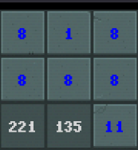 </td>
  </tr>
  <tr>
    <td colspan="2" width="100%" style="text-align:center"> Only one tile neighbors both Big Slimes and can be the Wizard. <br> So it is. </td>
  </tr>
</table>

If this method doesn't pinpoint the wizard, we can try spotting him using an edge Big Slime. A Big Slime on the edge (but not next to the corner)
must have another Big Slime on the edge exactly 2 tiles away (and the wizard inbetween). So if we spot such a Big Slime, and there is only
one option for the other Big Slime 2 tiles away, then that's where it is, and then we know the wizard is in the middle!

<table width="100%">
  <tr>
    <td width="33%">   </td>
    <td width="33%">   </td>
    <td width="33%">   </td>
  </tr>
  <tr>
    <td colspan="3" width="100%" style="text-align:center"> This edge Big Slime cannot have its twin two tiles above.
    <br> So it must be two tiles below.
    <br> So the wizard is inbetween. </td>
  </tr>
</table>


A similar exercise can be done with a Big Slime not on the edge. Such a Big Slime must have at least one other Big Slime
cross-neighbor that's not on the edge. If it can't be in one direction, it must be in the other! Then, the third one
must be even one tile further, and then the Wizard has been spotted.

<table width="100%">
  <tr>
    <td width="33%">   </td>
    <td width="33%">   </td>
    <td width="33%">   </td>
  </tr>
  <tr>
    <td colspan="3" width="100%" style="text-align:center"> This non-edge Big Slime cannot have a neighbor above.
    <br> So it must have a neighbor below, and two below.
    <br> So the wizard is on the edge inbetween. </td>
  </tr>
</table>

This doesn't work out of the box if our chosen Big Slime is near the corner, as then it could still be the middle one even
if it has only one neighbor Big Slime that's not on the edge. So in that case we double check whether this option is possible,
and only fill out the pattern (having this tile as the middle slime, or the corner slime) if exactly one option fits.

<table width="100%">
    <tr> <td> 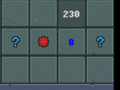 </td> </tr>
    <tr> <td style="text-align:center"> Because of the corner placement, we cannot tell <br> whether the leftmost or rightmost tile is a Big Slime. <br> We can be sure the marked tile is a Big Slime, though. </td> </tr>
</table>

And last little check we can make, is that if we have two unrevealed tiles, one on the edge and one near the edge, and they cannot hold a combined power
of 16 without going over the limit of some nearby attack number (i.e. they could not both be Big Slimes at the same time), then we can rule them both out.
Here it's also important not to make this judgment near the corner, where we could accidentally rule out an adjacent formation on the orthogonal wall.

<table width="100%">
    <tr> <td> 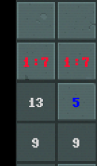 </td> </tr>
    <tr> <td style="text-align:center"> Although each unknown neighbor of 13 could hold a Big Slime with power 8, <br>
    since they cannot both hold it without going over its limit, we can rule them out. </td> </tr>
</table>

<h3> Gaze into your soul </h3>

Gazers are a problem, because they obscure themselves. They put `?`s on all revealed empty tiles with Manhattan distance <=2.
By their nature, we can never pinpoint their location using typical rules looking at attack numbers, because there will never be
any attack numbers near them. Instead, we have to weaponize `?`s themselves.

If there is a `?` for which only a single tile exists where the Gazer could be hiding and causing it to show up, then there he is!
The trick is to rule out Gazers from the tiles shrouded next to the `?`, so that we get to that single option quickly.

Here, we can turn the Gazer's power around and deduce as follows: if the Gazer puts `?` on all tiles with Manhattan distance <=2, then
if we see an attack number on some tile, there is no Gazer under any tile with Manhattan distance <=2 from it, so we can rule him out
from all of them.

It's important to note that, from a human point of view, you can usually guess where the Gazer is earlier. For example, in the situation below,
this pair of conditions is unable to locate the Gazer hiding under the marked tile:

<table width="100%">
    <tr> <td> 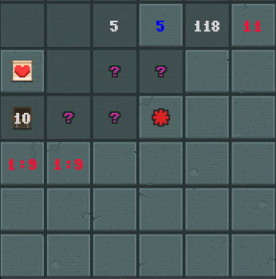 </td> </tr>
    <tr> <td style="text-align:center"> Technically each ? has more than 1 tile <br> from where a Gazer could apply it... </td> </tr>
</table>

So while you would spot it at this point, kill it, and reveal a lot of information, my known game state isn't smart enough.

If you just nodded along to this demonstration and are now a bit disappointed that my Gazer spotting logic is weak, then I will admit two things:

1. You're right, my Gazer spotting logic is kind of weak.

2. The marked tile isn't a Gazer, it's a Mine. If you clicked it, you would have lost the game.

<details markdown=1>
<summary> Boo(m)! </summary>

<table width="100%" markdown=true>
    <tr> <td> 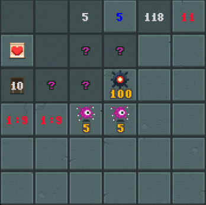 </td> </tr>
    <tr> <td style="text-align:center"> Prepare for trouble, because it's double </td> </tr>
</table>
</details>

<br>
So, from the perspective of the known game state, where it must not conclude false information, it really is better to be safe than sorry.

<h3> Even fancier type 2 rules </h3>

We may have some unrevealed tiles that we cannot determine just by looking at one neighboring attack number, but that we may determine
(at least something about) it if we look at several. Let's do that! 

<h4> V0 </h4>

If there are two neighboring attack-number tiles, and they share all unknown neighbors except one, we can directly calculate that one's power.

<table width="100%">
  <tr>
    <td width="50%">   </td>
    <td width="50%"> 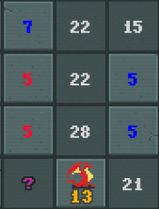 </td>
  </tr>
  <tr>
    <td colspan="2" width="100%" style="text-align:center"> The 28 above the dragon and the 22 above it share all unknown neighbors, 
    except the top-left (worst case 7) <br> Compared to the 28, the 22 does not neighbor the dragon, so it should see 13 less power; <br>
    But it is only 6 weaker, so the one unknown tile that it gained must be 13 - 6 = 7. 
    </td>
  </tr>
</table>

<h4> V1 </h4>

Even if two neighboring attack-number tiles have more than one unshared unknown neighbor, as long as all of the unshared neighbors are neighbors of just
one of them, we can determine the upper bound on their total power (even if we can't tell how it is distributed).

<table width="100%">
  <tr>
    <td width="50%">   </td>
    <td width="50%"> 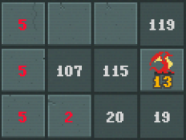 </td>
  </tr>
  <tr>
    <td colspan="2" width="100%" style="text-align:center"> Just looking at the 107 itself and all its neighbors, we can't tell what the left-side tiles are <br>
    But, because we know that the unknown tiles neighboring the 115 are a total of 115 - 13 = 102, <br>
    and the 107 shares all of them, they must add up to 107 - 102 = 5
    </td>
  </tr>
</table>

<h4> V2 </h4>

Even if two neighboring attack-number tiles each have some unknown neighbors that they do not share with the other, if they both have exactly one,
we can find the relationship between the powers of these two unknown tiles. In other words, it lets us make statements like 'this unknown tile is
exactly X more (or less) powerful than this other one'. We can then use this information to prune it -
if some tile X has lets say 2 more power than another tile Y,
we can eliminate all monsters from X with such power(s) P, for which we know that Y cannot be a monster with power P-2. Well, look at the example below.

<table width="100%">
  <tr>
    <td width="25%">   </td>
    <td width="25%">   </td>
    <td width="25%">   </td>
    <td width="25%"> 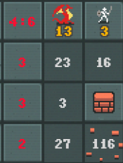 </td>
  </tr>
  <tr>
    <td width="25%" style="text-align:center"> Moving down from the '23' hint to the '3' hint, the difference is: <br> 
      We lose 16 known power, and the '6' unknown tile <br>
      We gain the unknown '3' tile
    </td>
    <td width="25%" style="text-align:center"> We lost 16 known power, but the hint changed by 20 <br>
      So the '3' tile must be 4 weaker than the '6' tile <br> 
      So it's at most 6 - 4 = 2 (we eliminated the skeleton from it)
      </td>
      <td colspan="2" width="50%" style="text-align:center"> And now the other way around: the '6' must be 4 stronger than what is now the '2' <br>
        Since the '2' could be empty (a 0), the '6' is at least 4 <br>
        (we eliminated actors with powers 0, 1, 2, and 3 from it)
      </td>
  </tr>
</table>

<h4> V3 </h4>

What if one attack-number tile has one unshared neighbor to itself, and its neighbor has several to itself? Can we still tell something?
Well, the bound becomes a bit weaker. We now have a statement of the form 'this bunch of tiles have a combined power X more (or less) than this one tile T'.
We cannot do exact elimination as before, since this power can be distributed arbitrarily amongst several tiles. But we can tell that no monster here will
be stronger than T's worst case power + X. So we get an upper bound.

Similarly in the other direction, we can't eliminate explicit monsters from T, but we
know that it will be X stronger than all of the other bunch'o'tiles combined. So sum up the lower bound on the possible power for each of them,
and eliminate everything from T which is smaller than that +X.

<table width="100%">
  <tr>
    <td width="50%">   </td>
    <td width="50%"> 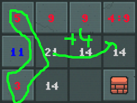 </td>

  </tr>
  <tr>
    <td width="50%" style="text-align:center"> moving from the '21' to the '14', we lose the left bunch of tiles and gain the right '9' <br>
    At the same time, 21 is missing 10 power (sees 11), while the 14 is missing 14 power <br>
    So, the left group of tiles combined is 14 - 10 = 4 weaker than the right '9', which is at most 9.
    </td>
    <td width="50%" style="text-align:center"> And by the same argument, the '9' is 4 more than the left group of tiles combined
    </td>
  </tr>
</table>

<h4> ...and with mines separately </h4>

Using the same shifting logic, if we have two neighboring attack-number tiles, where one needs X more mines around it,
and the other needs X+Y mines around it, then the unshared neighbors around the second tile need (at least) Y mines. If
there are Y of these unshared neighbors around the second tile, well, they are all mines.

Conversely, if one attack-number tile needs X+Y mines around it, but only has Y unshared neighbors with a second tile that can be mines,
then that means the shared neighbors of these tiles contain (at least) X mines.
So if the second tile can only have X more mines around it to begin with, all the *other* neighbors (the unshared ones) can *not* be mines.

<table width="100%">
  <tr>
    <td width="50%">   </td>
    <td width="50%"> 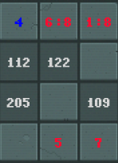 </td>

  </tr>
  <tr>
    <td width="100%" colspan="2" style="text-align:center"> The 109 needs (1+0) mines. It can only put 0 mines in tiles that are not neighbors
    of the 122. So there must be (at least) 1 mine in the shared neighbors with the 122. Since 122 only needs one mine, the neighbors it does
    not share with the 109, are not mines.
    </td>
  </tr>
</table>


<h3> What more could be done? </h3>

There certainly are ways to deduce even more things. There are still some invariants of the game that the we didn't make use of, and then there's &#9734;*advanced algorithmics*&#9734;.

From the invariant side, first is enemy counting - each game has a set amount of each enemy type, after all. We can count how many
of each enemy we've slain, plus how many more we identified, and if we reached the cap, we can remove this enemy from all unknown tiles! In practice,
this is already done for rats, slimes and mines once we cast their respective spells, for the guards on a per-quadrant basis, and for Big Slimes once we found
the Wizard. And for the rest, it just doesn't seem that important - by the time we've found all enemies of a single type, we've probably revealed basically the
entire dungeon, and by then we have so much more information to use to deduce the final tiles, that this probably wouldn't make much of a difference.

Another fancy fact we haven't used is the Gnome - did you know he always starts out neighboring a heal? Yes, it's true! Then again, the fact that
'some tile around where the Gnome was first spotted is a heal' isn't very powerful knowledge, and by the time we figure out it has zero power, we're going to reveal it anyway, and find out if it is the heal or not. Similarly, once the Gnome doesn't teleport, we know there are no more unrevealed empty tiles left - 
but by then, we can probably deduce everything without making use of this, since this usually happens very late into the game.

Well, and then there are the big and/or smart algorithms.

We could be doing many flavours of knapsacks and tilings to try and rule out certain combinations of enemies around each tile. However, this would be
A) quite complicated (you would have to have these knapsacks respect the rules, like Gargoyles need to be together, Lovers need to have the opposite tile
available for their partner...) and B) computationally intensive. These permutation-combination-y algorithms, across large sets of tiles that surround the known
space, would (unless used very conservatively) completely dwarf all the other computations we're doing, therefore worsening the performance by some order of magnitude. Running them all the time seems overkill. So let's just not bother. There is a certain beauty in just cobbling together all the simple things and
seeing them synergize, as opposed to 'just throw the overpowered try-it-all at it'.

Figuring out that the Gazers are far apart and then being able to make stronger assumptions to hunt them down would
also probably fall under this umbrella. On the bright side, this way you can feel smart when you pinpoint them before the bot brain does!

<h3> How to know everything and not have 10 FPS </h3>

Of course, if you take the current known game state and apply all the rules one after the other, you may gain more knowledge, and this knowledge might make it
possible to obtain more knowledge if you applied them again. So, we want to apply the rules over and over.

Initially I was simply running through all the rules at every frame of the game, however this soon made the game perform very poorly
(since many checks go through many pairs of tiles), so I had to figure out a way to detect when the rules weren't making any new deductions,
and resume only once an action has been taken.

So, each time, after we're done, we sum up the
sizes of the possible actors sets for all the tiles, and compare it to the same value from before we started. If these numbers are different, we note in our state
that the last update was *meaningful*, otherwise that it wasn't. In each frame, we go try and update our knowledge only if an action was taken, or if the last
update was meaningful. This works great, because if after an action we can only deduce things once, we stop quickly, if we get to make deductions further
and further down the grid, it will keep going as long as needed. 

Yay, optimized!

<h2> Solving the dungeon </h2>

We have all this theoretical knowledge, and need to put it into practice. What should Jorge actually do?

Let's quickly recount what we know:
- For every tile, the set of actors that could be on it
  - for some tiles we know exactly what is on it
- Jorge's HP
- Jorge's XP needed for next level
- Some facts about the state of the game (like which spells we already cast)

And we need to decide just one thing:

- Which tile to click?

(...or maybe we should level up)

There are many things we could/should be taking into account:
- efficient use of HP
- revealing tiles that will give us a lot of information
- killing enemies that let us cast spells
- we like to guarantee winning the game
- ...we don't want to die...
- working towards the mine king
- dragon egg is free xp woo!

So let's just prioritize the above somehow, and pick the first tile in that priority list that lets us accomplish the given goal.
This entire section is written in the exact same order as what the 'Solver' is looking at.

<h3> 1. Free actions </h3>

There are some benefitial actions that we can take at no cost to us!

We will consider these actions to be 'free' and beneficial:
- Collecting any available xp
- Opening chests we know for sure are chests
- Casting spells
- Revealing tiles we know have 0 power
- Leveling up with 0 hp

If at any time we can do one of those, we should!

<table width="100%">
    <tr> <td> 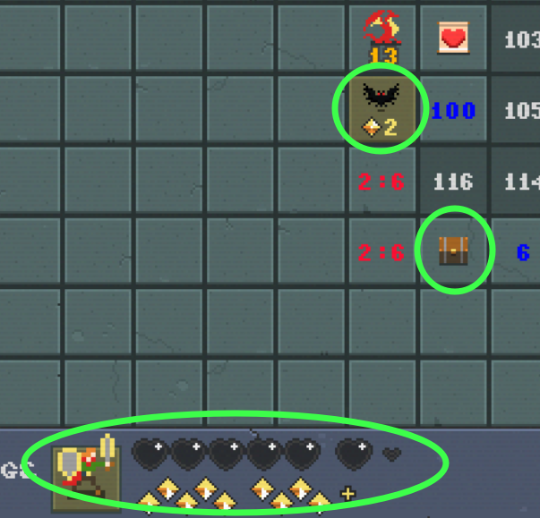 </td> </tr>
    <tr> <td style="text-align:center"> Collecting xp, opening a chest, and leveling up optimally <br> are always good actions to take! </td> </tr>
</table>

<h3> 2. VIPs </h3>

Apart from the usual hp-optimizing information-gathering clearing of the dungeon we are doing,
there also exist some monsters which have a unique return on 'investment'.
The Mine King, the Rat King, and the Wizard let us cast cool spells as a reward for beating them!
Gazers also reveal a lot of information when defeated.

In a mindless frenzy, if we known where any of the monsters above is and have the hp to take them out, we will do so.
We consider them in the order mentioned above.

<table width="100%">
    <tr> <td> 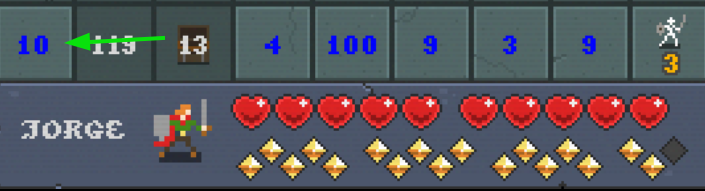 </td> </tr>
    <tr> <td style="text-align:center"> It doesn't matter what else is on the board. <br> The Mine King's getting it. </td> </tr>
</table>

As a conditional insert, we will also consider the Lovers as VIPs if we have no heals available and not enough health
to make it to the next level up. They are put in behind the Mine King in the priority list.

<h2> Coming soon </h2>

- A section on how the solver picks its next move (WIP)
- A more detailed section about the solver's performance and how we got there
- Advanced section (how to add more code? how to test?)
